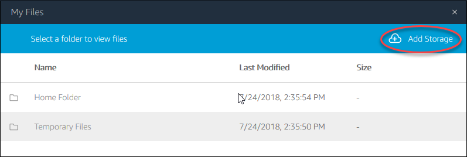
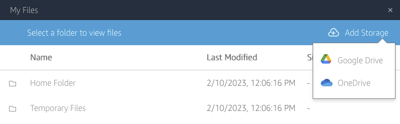
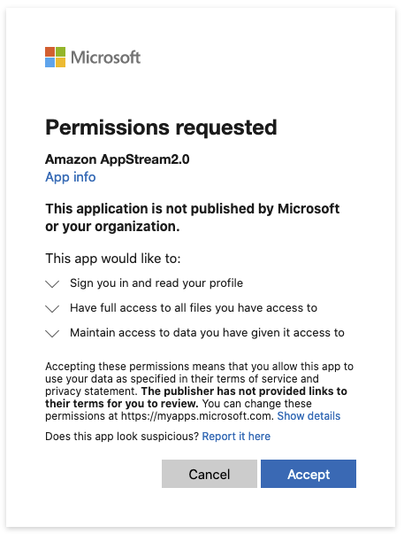
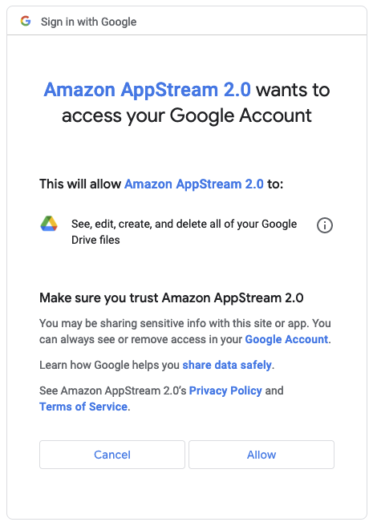
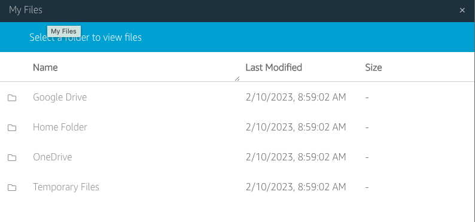
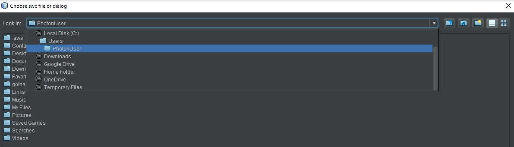

The deployment uses AWS CDK to create AWS resources on your AWS account as shown in the diagram below. All services run in a secured Virtual Private Cloud (VPC).



## Install prerequisites

You should have **node v14** installed on your local machine. We recommend using [nvm](https://github.com/nvm-sh/nvm) to install and activate this version of node.

* Install AWS CLI
  * AWS CDK requires AWS CLI to be installed and configured on the computer from which one runs the deployment procedure. [Installation](https://docs.aws.amazon.com/cli/latest/userguide/cli-chap-getting-started.html) & [configuration](https://docs.aws.amazon.com/cli/latest/userguide/cli-chap-configure.html) instructions can be found in the AWS documentation.

## Get the deployment scripts

Clone the [HortaCloud GitHib repository](https://github.com/JaneliaSciComp/hortacloud) containing the deployment scripts:

```bash
git clone https://github.com/JaneliaSciComp/hortacloud/
cd hortacloud
```

Install the dependencies:

```bash
npm install
npm run setup -- -i
```

This command will install all packages that are needed to run the deployment procedure. The '-i' flag will tell the setup script to install npm packages for all application modules: cognito_stack, vpc_stack, workstation_stack and admin_api_stack. If you do not specify the '-i'  flag, the command will only check the .env file and create it in case it's missing. Notice how the '-i' flag is preceded by two hyhens '--' - this is specific to npm not to cdk, so all script specific flags must be after the double hyphen separator.

## Configure environment

The following values must be set in the `.env` file:

```properties
AWS_REGION=<your aws region>
AWS_ACCOUNT=<your aws account>

HORTA_ORG=<app qualifier name>
ADMIN_USER_EMAIL=<admin email>

JACS_JWT_KEY=<a 32 byte jwt secret>
JACS_MONGO_KEY=<a 32 byte mongo secret>
JACS_APP_PASSWD=<app password>
RABBITMQ_PASSWD=<rabbitmq password>
JACS_API_KEY=<jacs api key>
JADE_API_KEY=<jade api key>
HORTA_DATA_BUCKETS=<s3 buckets that hold MouseLight data>
```

The api keys and secrets have been randomly generated during the setup step, but you can generate new ones with the following command:

```bash
openssl rand -hex 32
```

We prefer this procedure because these values will be handled during the installation using the `sed` command and it is preferable that they not contain any characters that require escaping in a sed command.

If you already have data on some S3 buckets you can add them to `HORTA_DATA_BUCKETS` as a comma separated list. For example, if you want to use Janelia's Open Data bucket but in addition you also have your data on a private bucket ('janelia-mouselight-demo' in this example) you need to set `HORTA_DATA_BUCKETS="janelia-mouselight-imagery,janelia-mouselight-demo"`. By default, only the MouseLight Open Data bucket is mounted. Every bucket specified in the 'HORTA_DATA_BUCKETS' list will be available in Horta as `/s3data/<s3BucketName>` directory.

If you want to change the setting for `HORTA_WS_INSTANCE_TYPE`, keep in mind that you may have to change `HORTA_WS_IMAGE_NAME`.

For `HORTA_WS_INSTANCE_TYPE` set to any `stream.graphics.g4dn.*` instances:

* `stream.graphics.g4dn.xlarge`
* `stream.graphics.g4dn.2xlarge`
* `stream.graphics.g4dn.4xlarge`
* `stream.graphics.g4dn.8xlarge`
* `stream.graphics.g4dn.12xlarge`
* `stream.graphics.g4dn.16xlarge`

use: `HORTA_WS_IMAGE_NAME=AppStream-Graphics-G4dn-WinServer2019-09-01-2022` image.

For `HORTA_WS_INSTANCE_TYPE` set to any `stream.graphics-pro.*` instances:

* `stream.graphics-pro.4xlarge`
* `stream.graphics-pro.8xlarge`
* `stream.graphics-pro.16xlarge`

use `HORTA_WS_IMAGE_NAME=AppStream-Graphics-Pro-WinServer2019-09-01-2022` image

Note: AWS deprecates the AppStream images relatively frequently so please make sure you use an AppStream-Graphics image that is available on AWS. You can see the available images from the AWS console if you select the "AppStream 2.0" service and then search "Images > Image Registry"

## Configure AWS account

### IAM Required Roles

In order to create an AppStream Image Builder, which is needed to create the Workstation Image, you need to have all [roles required by AppStream](https://docs.aws.amazon.com/appstream2/latest/developerguide/roles-required-for-appstream.html). Check that by simply connecting to the AWS console and check if the Roles are available in the IAM Service - select "Services" > "Security, Identity, Compliance" > "IAM" then verify that the required roles are present:

* AmazonAppStreamServiceAccess
* ApplicationAutoScalingForAmazonAppStreamAccess
* AWSServiceRoleForApplicationAutoScaling_AppStreamFleet

### Enable Google Drive and/or OneDrive for Horta Cloud Workstation

Data access from Google Drive or OneDrive can be enabled at deployment time by simply setting the corresponding enterprise domains in `HORTA_GOOGLE_DOMAINS` or `HORTA_ONE_DRIVE_DOMAINS`. This can also be done after deployment directly from the AWS Console while the stack is running. Check [AWS Appstream docs](https://docs.aws.amazon.com/appstream2/latest/developerguide/persistent-storage.html) how to enable these options directly from the AWS Console. 
If your application does not see Google Drive and/or OneDrive for uploading or saving files, the storage must be added directly from the AppStream toolbar using the following steps (The procedure is well documented in the [AWS Docs](https://docs.aws.amazon.com/appstream2/latest/developerguide/google-drive-end-user.html]):
* Select **My Files** icon from the toolbar 
* In the **My File** dialog click on *Add Storage* on the top right of the **My Files** dialog

* Then select the Drive and the account you want to use.


* At this point if AppStream has not yet been authorized to access the selected storage, Google Drive or OneDrive may ask you to authorize AppStream to access the storage.


* Once you authorized access to your storage, it will appear in the **My Files** dialog, and the **Add Storage** button will no longer be available

* In the applications the new added storage options will look like this:


### AWS Limits

Most AWS services allow you to setup restrictions on the number of active instances. The default limits, especially for some AppStream resources, such as "Maximum ImageBuilders" for some graphics instances - "stream.graphics.g4dn.xlarge" may be really low (0 in some cases). Connect to AWS console "Service Quotas" service and increase the limit for in case you see a `limit was exceeded` error. Typically take a look at the limits setup for your account for EC2, VPC, AppStream, S3. Keep in mind that limits may be different from instance type to instance type for AppStream service, so you may have to adjust the limits based on the AppStream instance type selection.

## Deploy HortaCloud services

After the setup is complete, deploy the application by running:

```bash
npm run deploy
```

First time the application is deployed we also need to create user login pool and this must be explicitly specified using '-u' flag [See **Deploy the user login stack** section below]:

```bash
npm run deploy -- -u
```

There are a few steps during the deployment that require manual intervention. The deploy script will indicate when these steps should be taken with a ⚠️  warning message.

The full deployment of the application is done in 3, or 4 steps - if user login stack is deployed too, that run automatically one after the other,
with some manual intervention for **AppStream builder** step (third step outlined below):

1) **Deploy the user login stack** - this step is optional and practically is only needed first time the application is deployed. To create the user login stack you need to pass in '-u' flag to the deploy command (`npm run deploy -- -u`) which will automatically create a Cognito user pool and the 'admin' user and 'admins' group. You also have an option to import cognito users from a backup (`npm run deploy -- -u \
-r -b janelia-mouselight-demo -f hortacloud/backups/20220511030001/cognito`) but in this case you may need to skip the creation of the default admin user and group.

2) **Deploy the back-end stacks** - this includes the AppStream builder. At the back end deployment the installation process will also create the admin user configured in `ADMIN_USER_EMAIL`.

3) **Connect to AppStream builder and install the Horta application** - This is a semiautomated step that involves copying and running two PowerShell scripts onto the AppStream builder instance.

4) **Deploy the administration stack.**

### Install the Horta desktop application

For client installation start and connect to the AppStream builder instance then copy the following scripts from this repo to the AppStream instance:

* [installcmd.ps1](https://github.com/JaneliaSciComp/hortacloud/blob/main/vpc_stack/src/asbuilder/installcmd.ps1) - installs JDK and the Horta application
* [createappimage.ps1](https://github.com/JaneliaSciComp/hortacloud/blob/main/vpc_stack/src/asbuilder/createappimage.ps1) - creates the AppStream image

After you copied or created the scripts:

* Log in to the AWS console and go to <https://console.aws.amazon.com/appstream2>
* Find your new builder in the "Images > Image Builder" tab
* Click on the image name and open an "Administrator" window by clicking on the "Connect" button.
* Copy the installation scripts from your local machine to AppStream:
  * Click on the folder icon at the top left of the window
  * Select the `Temporary Files` folder
  * Use the `Upload Files` icon to find the files on your machine and upload them.
* Open the powershell by typing "`Power shell" in the search found at the bottom left of the window. This step used to require an "Administrator Power Shell" but now it needs only a regular user power shell and it may actually fail the install if you run it in an Administrator Power Shell.
* Change to the directory where you uploaded the installation scripts, eg:

```powershell
cd 'C:\Users\ImagebuilderAdmin\My Files\Temporary Files'
```

* Run the installcmd script to install Horta. &lt;serverName&gt; is the name of the backend EC2 instance, typically it looks like `ip-<ip4 with dashes instead of dots>.ec2.internal`. Instructions for locating this are provided as output from the installer script. The Horta client certificate is signed using the ec2 internal name so do not use the actual IP for the &lt;serverName&gt; parameter, because user logins will fail with a certificate error.

```powershell
installcmd.ps1 <serverName>
```

  This will install the JDK and Horta. The installer will run silently and it will install the Horta application under the `C:\apps` folder. If it prompts you for the install directory, select `C:\apps` as the JaneliaWorkstation location.

* *Optional* - To start Horta for testing, run:

```powershell
c:\apps\runJaneliaWorkstation.ps1
```

* when prompted, login as the admin user you set in ADMIN_USER_EMAIL (leave the password empty)
* Navigate through the menus to make sure Horta is working. *Do not create any user accounts at this time as they will get created from the Admin web application.*
* When testing is finished, close down Horta.

* Finalize the creation of the AppStream image, run:

```powershell
createappimage.ps1
```

  Keep in mind that once you start this step the builder instance begins the snap shotting process and it will not be usable until it completes. After this is completed the AppStream image should be available and the builder will be in a stop state. To use it again you need to start it and then you can connect.

* You can now safely close the AppStream session and return to the AppStream console. There you will see a new image in the image registry with a status of `Pending`.
* Once the image status has changed to a status of `Available` you can start the fleet by going to the `Fleets` page on the AppStream site.
  * Select your fleet from the list of fleets and then select 'Start' from the `Action` menu.
* At this point the installation script you started on your host machine, should continue to completion.

## Customizing the portal URL

By default the application will have a very long url that is not easy to remember, something like:
<http://janelia-hortacloudwebapp-janeliahortacloudwebadmi-yefcny29t8n6.s3-website-us-east-1.amazonaws.com/>. Follow these instructions to create a shorter domain for use with your installation.

* Register a domain with Route53 or your domain provider.
  * The Route53 page in the AWS console has a "Register domain" form.
  * Alternative providers can also be used, but it requires a little more work.
* Purchase an SSL certificate for your domain.
  * This can be done with [AWS Certificate Manager](https://aws.amazon.com/certificate-manager/)
  * or an external certificate provider, often it can be done with the same company that provided your domain registration. Use the "Import a certificate" button to register your certificate with AWS.
* Use the "Create distribution" button on the CloudFront console to attach your registered domain to the s3 bucket that hosts the admin portal.
  * the only things that need to be changed from the defaults are
    * "Origin domain" - this should be the domain that was originally generated for your admin portal.
    eg: *janelia-hortacloudwebapp-janeliahortacloudwebadmi-yefcny29t8n6.s3-website-us-east-1.amazonaws.com*
    * "Viewer protocol policy" - Change this to "Redirect HTTP to HTTPS"
    * "Custom SSL certificate" - Select the certificate that you registered with AWS Certificate Manager
  * Finally, click the "Create distribution" button.

## Uninstalling HortaCloud services

To completely uninstall the application run:

```bash
npm run destroy -- -u
```

The command will uninstall all stacks including the user logins (Cognito) stack.

Note in the previous [system upgrade section](#Upgrading_HortaCloud_services_to_AWS) that an upgrade typically does not require removing and recreating the user pool stack.

## Troubleshooting

### Troubleshooting client app installation

If the client app installation fails for any reason, before you attempt the install again you must remove everything that was installed by the install script. Uninstall all applications installed with scoop and remove the 'C:\apps' folder. To do that run:

```powershell
scoop uninstall scoop
del c:\apps
```

When prompted whether you really want to uninstall everything, select "yes" or "all".
